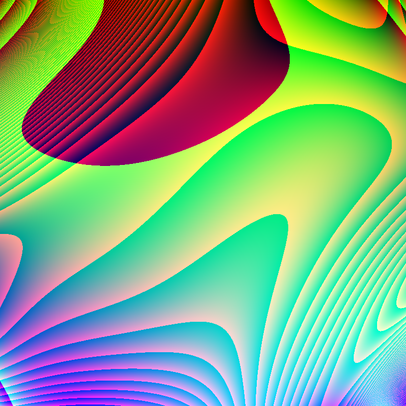

# Hash Visualiser (RandomArt Generator)

This project is a simple implementation of a hash visualisation (randomart) generator, inspired by the approach described in the referenced research paper. The generator creates random unique images from hash-like data using a grammar-based method.

## Example Output

Below is an example of an image generated by the program:

## How it Works
- The program uses a grammar-based approach to generate random images.
- The logic is implemented in C, following the method described in the research paper.
- each compimlation outputs random image, also vizually appealing(if lucky)

## Reference

The method is based on the following research paper:

[Visualisation of Hashes using Random Art](https://www.dirk-loss.de/sshvis/drunken_bishop.pdf)

---
