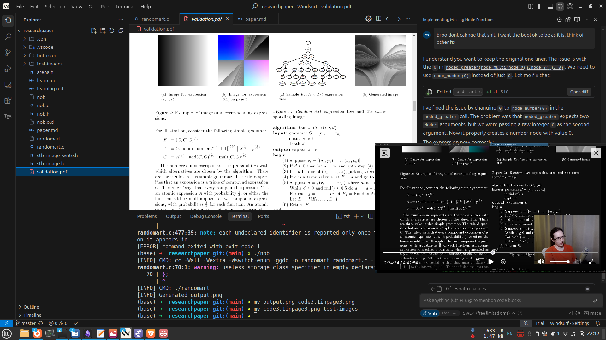

1. The random art algorithm.
    it is basicalling an algorithm that here is used for hash vizualization of ssh keys.

   - 'Random Art is an algorithm such that given a bit-
    string as input, it will generate a function F: [-1, 1]^2->
    [-1, 1]^3, which de nes an image. The bit-string input is
    used as a seed for the pseudo-random numb er generator,
    and the function is constructed by cho osing rules from a
    grammar dep ending on the value of the pseudo-random
    numb er generator. The function F maps each pixel (x; y )
    to a RGB value (r,g,b) which is a triple of intensities for
    the red, green and blue values, resp ectively. For example,
    the expression F (x; y ) = (x; x; x) pro duces a horizontal
    gray grade, as shown in gure 2(a). A more complicated
    example is the following expression, which is shown in
    gure 2(b)'

    The function takes the normalizsed coordinates{[-1,1]^2}uj value and  stores them into rgb values { [-1,1]^3} . generates grey gradiant. 

2.function F is  also seen as  Expression tree(AST) using grammer G.
    Its taking random grammer, generating an AST, i.e , generating language code and use the language to interpret it and generate the  greyscale image 

 - use specified  sequence of bytes from the tree as a random number generator.

 

- the powers of 1/3 indicate the probablity of the option being chosen when iterating thoruugh the grammer, this branch will get picked.

    
    

    
